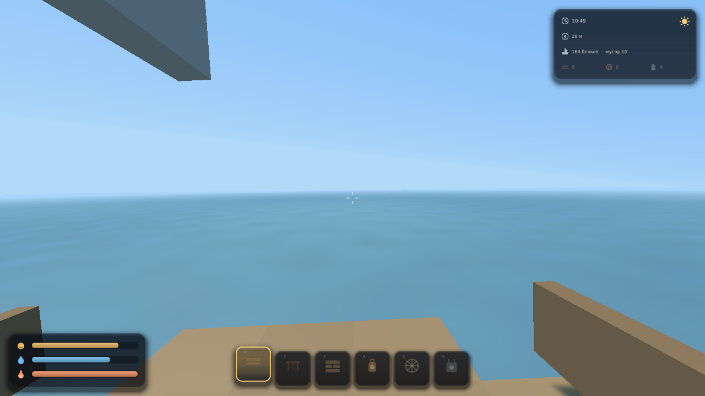
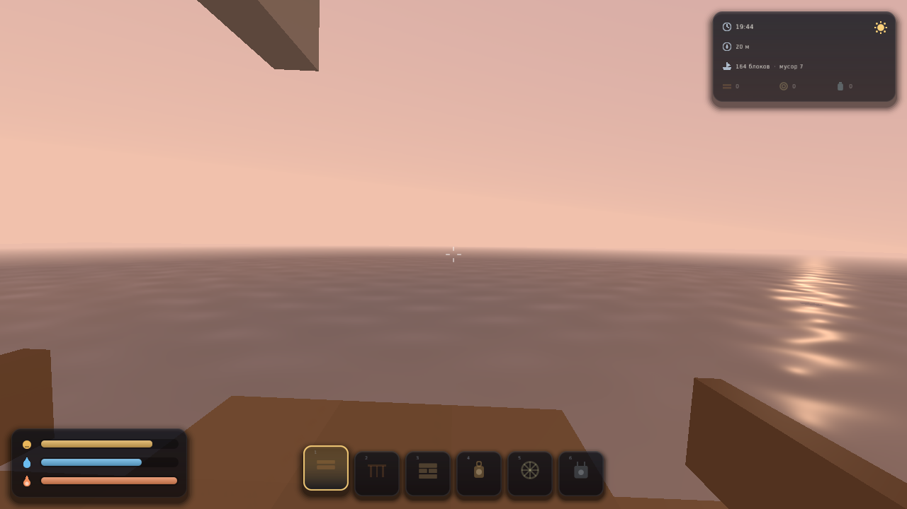
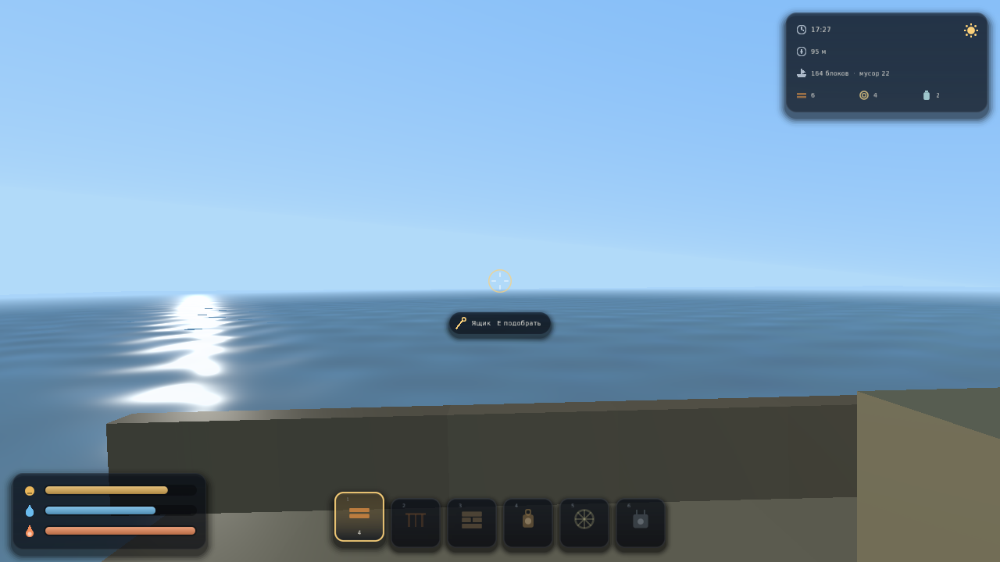

# The Boat

Уютная воксельная игра про жизнь на лодке посреди бесконечного океана.
Сделана на движке [SAGE Engine](https://github.com/AmckinatorStudios/SAGE-Engine).

Земли нет. Есть скромный кораблик с палубой, каютой и парусом — и вода во все
стороны до горизонта. Течение несёт мимо мусор: бочки, ящики, брёвна,
водоросли, буи. Ты вылавливаешь его багром, разбираешь на материалы и понемногу
превращаешь лодку в дом: настилаешь палубу, ставишь стены, вешаешь фонарь,
собираешь опреснитель и сеть. Можно и наоборот — разобрать пару досок из
собственного борта, если они нужнее в другом месте.

**Здесь некуда спешить и негде проиграть.** Нет врагов, нет таймера, нет смерти.
Сытость и жажда убывают за десятки минут и служат поводом встать и заняться
делом, а не угрозой. Главное занятие игры — смотреть, как солнце садится в воду.



| Закат над водой | Палуба, мачта и борта |
|---|---|
|  |  |

> **Зачем эта игра существует.** Это первая игра на SAGE Engine и одновременно
> проверка движка на настоящей работе. Бесконечный океан с волнами, корабль как
> сетка блоков, плавучий мусор на **настоящей физике движка**, стройка, крафт,
> шкалы и смена суток — всё это **скрипты на Lua**: в движке нет ни строчки,
> знающей про воду, лодки или блоки. Проект открывается редактором SAGE как
> обычный проект, играется в его Play-режиме и собирается в самостоятельный exe
> кнопкой File → Build Game.

---

## Как играть

| Клавиша | Действие |
|---|---|
| `W` `A` `S` `D` / стрелки | движение по палубе (за бортом — плыть) |
| Мышь | обзор |
| `Space` | прыжок / всплыть |
| `Ctrl` | быстрый шаг |
| `E` | подобрать мусор багром (наведись на него) |
| Левая кнопка мыши | разобрать блок корабля (держать) |
| Правая кнопка мыши | поставить блок из выбранного слота |
| колесо мыши, `Tab` | выбрать слот |
| `1`…`8` | крафт (см. таблицу ниже) |
| `F` / `G` | поесть / попить |
| `R` | закинуть удочку (нужна удочка) |
| `Esc` | вернуть курсор, второй раз — выйти |

**Мусор ловится багром**: наведи прицел на плывущий предмет в пределах восьми
метров и нажми `E`. Прицел прощает промах — попадать в точку не нужно.

**Палуба достраивается по воде**: встань у края, посмотри вниз на воду рядом с
бортом и нажми правую кнопку. Доска ляжет туда, куда смотришь, если рядом есть
корабль.

### Крафт

| Клавиша | Что получается | Из чего |
|---|---|---|
| `1` | 1 доска | 2 обломка |
| `2` | 2 леера | 1 обломок + 1 верёвка |
| `3` | 2 стены | 3 обломка |
| `4` | фонарь | 2 обломка + 2 пластика |
| `5` | сеть | 3 верёвки + 1 пластик |
| `6` | опреснитель | 3 пластика + 2 обломка |
| `7` | удочка | 1 обломок + 2 верёвки |
| `8` | парус | 3 ткани + 1 верёвка |

**Фонарь** греет ночью и светит по-настоящему (это источник света движка).
**Сеть** сама подтягивает проплывающий рядом мусор. **Опреснитель** делает
пресную воду. **Парус** прибавляет ходу.

---

## Как запустить

Нужен собранный SAGE Engine (CMake + компилятор с C++17).

```bash
git clone https://github.com/AmckinatorStudios/SAGE-Engine.git
cmake -S SAGE-Engine -B SAGE-Engine/build -DCMAKE_BUILD_TYPE=Release
cmake --build SAGE-Engine/build -j
./SAGE-Engine/build/runtime/SagePlayer /путь/к/The-Boat
```

Или одной командой — скрипт сам найдёт или соберёт движок:

```bash
./tools/run.sh            # играть
./tools/run.sh --editor   # открыть проект в редакторе SAGE
./tools/run.sh --check    # автопрогон без окна (то же, что гоняет CI)
```

### Параметры запуска

`--ключ=значение` в командной строке или через `SAGE_GAME_ARGS`:

| Параметр | Смысл |
|---|---|
| `--seed=N` | зерно (порядок появления мусора) |
| `--time=0.82` | время суток при старте: 0 — полночь, 0.5 — полдень |
| `--autopilot=1` | автопрогон: игра играет в себя сама (CI) |

---

## Как это устроено

Сцена `scenes/main.sage` содержит ровно три сущности: `World` (на ней висит
`game.lua`), `Player` и дочерняя к нему `Player Camera`. Океан, корабль,
интерфейс и весь мусор порождаются из Lua во время игры.

| Файл | За что отвечает |
|---|---|
| `game.lua` | точка входа: собирает игру из модулей, раскладка, игровой цикл |
| `ocean.lua` | бесконечный океан: волны, пена, перецентровка сетки воды |
| `ship.lua` | корабль: сетка блоков, качка на волне, луч, столкновения, стройка |
| `debris.lua` | плавучий мусор на физике движка: выталкивание, течение, подбор |
| `player.lua` | от первого лица: ходьба по палубе, плавание, багор, стройка |
| `survival.lua` | сытость, жажда, тепло, смена суток, цвет неба и воды |
| `blocks.lua` | реестр блоков и предметов |
| `inventory.lua` | инвентарь, хотбар, рецепты |
| `hud.lua` | интерфейс: карточки, шкалы, панель предметов, судовой журнал |
| `autopilot.lua` | игрок-автомат для CI: живёт на лодке теми же действиями |
| `shaders/water.vert` | форма волны: гнёт вершины плиток, считает нормаль |
| `shaders/water.frag` | цвет воды: впадина→гребень, пена, рябь, Френель |
| `materials/water.sagemat` | материал воды: прозрачность и параметры волны |

### Четыре решения, на которых держится всё остальное

**Океан — это функция, а не объект.** Высота воды в точке считается суммой трёх
синусоид от координат и времени. Хранить нечего, поэтому мир бесконечен в самом
буквальном смысле: за краем карты ничего не кончается, потому что карты нет.
Видимая вода — сетка плиток, которая не создаётся и не удаляется при движении, а
переезжает: плитка, уехавшая за край, встаёт на противоположный. Число сущностей
на бесконечном океане постоянно.

**Корабль живёт в своих координатах.** Каждый блок — дочерняя сущность корневой
«Ship», и в мир его переводит движок, перемножая матрицы иерархии: качка стоит
одну правку трансформа корня в кадр вместо сотни. Игрок хранит позицию тоже в
корабельных координатах — он стоит на палубе, а не в мире. Иначе каждая волна
отрывала бы его от пола: доски уехали вверх, а он остался. За бортом координаты
становятся мировыми, и это единственное место, где две системы встречаются.

**Мусор считает физический движок.** У каждого обломка есть RigidBody и
коллайдер, их шагает Jolt. Скрипт прикладывает только то, чего в физическом
движке нет, потому что воды в нём не существует: выталкивание (пружина к
поверхности волны), вязкость, течение и лёгкое отталкивание от корпуса — блоки
корабля физике неизвестны, это сетка, а не тела.

**Воду рисует свой шейдер, а не скрипт.** Раньше высоту каждой плитки двигал
Lua, и море выходило ступенчатым: четыре метра поверхности поднимались одним
куском. Теперь вершины гнёт `water.vert`, мелкую рябь считает `water.frag` по
пикселям, а вода полупрозрачна — при том же числе сущностей и том же ОДНОМ
draw call'е на весь океан. Формула высоты в `ocean.lua` и в шейдере одна и та
же и расходиться им нельзя: скрипту она нужна для качки и плавучести, шейдеру —
для картинки.

### Что игра потребовала от движка

Часть возможностей появилась в SAGE Engine именно из-за неё:

* `require` и пути поиска модулей — игра размером больше одного файла;
* `BindAction` — раскладка объявляется игрой, а не зашита в C++;
* `GetMouseDelta` / `SetMouseCaptured` — вид от первого лица из Lua;
* `LaunchArg` / `LaunchFlag` — зерно, время суток и автопрогон снаружи;
* **тела физики для сущностей, порождённых в рантайме** — до этого всё, что
  игра создавала после старта, физики не получало вовсе (молча: компонент есть,
  тела нет), а удалённые сущности навсегда оставляли тело в мире;
* **небо в API освещения** — без него цикл суток выходил половинчатым: свет,
  туман и вода темнели к ночи, а купол неба оставался полуденно-синим;
* **полная альфа-прозрачность** — до неё полупрозрачный объект просто рисовался
  поверх; вода обязана смешиваться, и обязана делать это, оставаясь ОДНИМ draw
  call'ом на 2809 плиток;
* **свои шейдеры материала** — с сохранением инстансинга, освещения и тумана:
  иначе воду пришлось бы либо рисовать штатным шейдером (никакой волны), либо
  платить за неё тысячей вызовов;
* **иконки, градиенты и тени в UI** — интерфейс из голых прямоугольников с
  подписями выглядел как отладочный, а не как интерфейс игры про уют.

---

## Открыть в редакторе

```bash
./SAGE-Engine/build/editor/SageEditor
# File → Open Project… → папка The-Boat
# File → Scenes → main.sage, затем Play
```

В Play-режиме управление уходит игре, когда в фокусе панель **Game**; `Esc`
возвращает курсор редактору. `File → Build Game…` упаковывает проект в
самостоятельную игру.

Headless-прогон (тот же, что гоняет CI):

```bash
SAGE_EDITOR_OPEN_PROJECT=/путь/к/The-Boat \
SAGE_EDITOR_PLAY_SECONDS=240 \
SAGE_GAME_ARGS="autopilot=1" \
  ./SAGE-Engine/build/editor/SageEditor
```

---

## Известные ограничения

* Горизонт — 104 метра; дальше мир скрыт дымкой, а не нарисован. Блок здесь —
  сущность ECS, а не грань в общем меше чанка; настоящий меш снял бы потолок, но
  это работа для движка, а не для скриптов.
* Волны считаются только вблизи лодки: дальше амплитуда плавно гаснет до нуля.
  На глаз это незаметно, но вода у горизонта действительно плоская.
* Крен корабля виден глазу, но не столкновениям: блоки палубы наклоняются
  вместе с корпусом, а сетка, по которой ходит игрок, остаётся прямой.
* Мир не сохраняется между запусками: постройки живут до выхода.
* Мусор проходит сквозь корпус, если подтолкнуть его вплотную — корабль для
  физического движка не существует, его обходят силой отталкивания.
