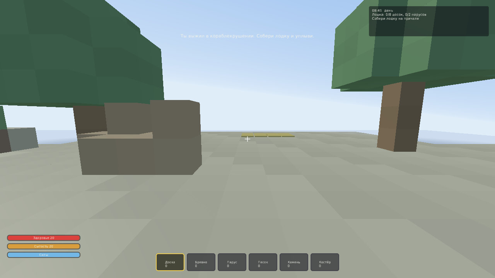
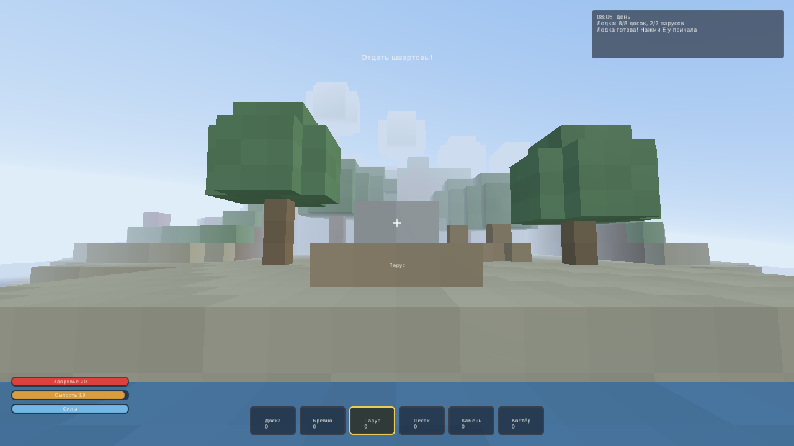
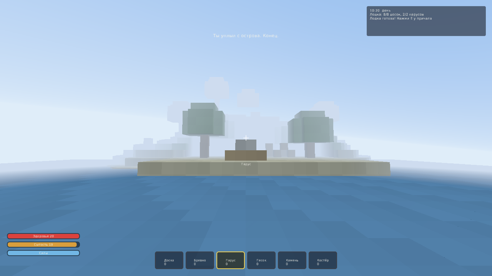

# The Boat

Воксельная игра на выживание от первого лица на движке
[SAGE Engine](https://github.com/AmckinatorStudios/SAGE-Engine).

Ты выжил в кораблекрушении и очнулся на песчаном берегу посреди океана. Остров
даёт всё, что нужно, чтобы уйти с него: деревья на доски, листву на паруса,
камень на костёр и ягоды, чтобы дожить до утра. Собери на причале лодку и уплыви.

> **Зачем эта игра существует.** Это первая игра, сделанная на SAGE Engine, и
> одновременно проверка самого движка на настоящей работе: воксельный мир,
> обзор от первого лица, добыча и постройка, шкалы выживания, смена суток и весь
> интерфейс написаны **скриптами на Lua** — в движке нет ни строчки, знающей про
> воксели. Проект открывается редактором SAGE как обычный проект, играется в
> его Play-режиме и собирается в самостоятельный exe кнопкой File → Build Game.



| Лодка собрана на причале | Финал: остров позади |
|---|---|
|  |  |

---

## Как играть

| Клавиша | Действие |
|---|---|
| `W` `A` `S` `D` / стрелки | движение |
| Мышь | обзор |
| `Space` | прыжок (в воде — всплыть) |
| `Ctrl` | бег (тратит силы) |
| `Shift` | шаг крадучись |
| Левая кнопка мыши | ломать блок (держать) |
| Правая кнопка мыши | поставить блок из выбранного слота |
| `1`…`6`, колесо мыши | выбрать слот хотбара |
| `E` | использовать / отплыть, стоя на готовой лодке |
| `F` | съесть ягоды |
| `C` / `V` / `B` | скрафтить доски / парус / костёр |
| `Esc` | вернуть курсор, второй раз — выйти |

**Рецепты**

| Что | Из чего |
|---|---|
| 4 доски | 1 бревно |
| 1 парус | 4 листвы |
| 1 костёр | 2 доски + 1 камень |

**Цель.** На причале у воды размечены золотыми плитами 8 клеток. Застели их
досками и подними над ними 2 паруса — лодка готова. Встань на неё и нажми `E`.

**Что может убить.** Голод (ешь ягоды с кустов), падение с высоты больше трёх
блоков, вода без воздуха и ночной холод вдали от костра. Ночь наступает быстро:
сутки идут 4 минуты.

---

## Как запустить

Нужен собранный SAGE Engine (см. его README: CMake + компилятор с C++17).

```bash
# 1. Собрать движок
git clone https://github.com/AmckinatorStudios/SAGE-Engine.git
cmake -S SAGE-Engine -B SAGE-Engine/build -DCMAKE_BUILD_TYPE=Release
cmake --build SAGE-Engine/build -j

# 2. Запустить игру рантаймом движка
./SAGE-Engine/build/runtime/SagePlayer /путь/к/The-Boat
```

Или одной командой — скрипт сам найдёт или соберёт движок:

```bash
./tools/run.sh            # собрать движок при необходимости и играть
./tools/run.sh --editor   # открыть проект в редакторе SAGE
./tools/run.sh --check    # headless-прогон: игра проходит себя сама
```

### Параметры запуска

Передаются как `--ключ=значение` или через `SAGE_GAME_ARGS`:

| Параметр | Смысл |
|---|---|
| `--seed=N` | зерно генерации мира (по умолчанию `20240517`) |
| `--view=N` | дальность прогрузки в чанках, 1…8 (по умолчанию `3`) |
| `--autopilot=1` | автопрогон: игра проходит себя сама (используется в CI) |

```bash
./SagePlayer /путь/к/The-Boat --seed=7 --view=4
```

---

## Как это устроено

Вся игра — скрипты в `assets/scripts/`. Сцена `scenes/main.sage` содержит ровно
три сущности: `World` (на ней висит `game.lua`), `Player` и дочерняя к нему
`Player Camera`. Всё остальное — остров, интерфейс, лодка — порождается из Lua
во время игры.

| Файл | За что отвечает |
|---|---|
| `game.lua` | точка входа: собирает игру из модулей, объявляет раскладку, крутит игровой цикл |
| `voxel.lua` | воксельное ядро: хранение мира, видимость граней, прогрузка чанков, луч кирки, столкновения |
| `worldgen.lua` | генерация острова: карта высот на своём шуме, пляж высадки, деревья, руда, обломки |
| `blocks.lua` | реестр блоков: цвет, прочность, что падает |
| `player.lua` | контроллер от первого лица: ходьба, прыжок, плавание, добыча, установка |
| `survival.lua` | здоровье, голод, силы, кислород, холод, смена суток и небо |
| `inventory.lua` | инвентарь, хотбар, рецепты |
| `hud.lua` | интерфейс из UI-компонентов движка |
| `boat.lua` | цель игры: сборка лодки на причале и финал |
| `autopilot.lua` | игрок-автомат для CI: проходит игру теми же действиями, что человек |

### Два решения, на которых держится всё остальное

**Мир не хранится поблочно.** Первозданный ландшафт вычисляется на лету из карты
высот — одна запись на колонку вместо ячейки на каждый блок. Отдельно лежит
оверлей правок: деревья, руда и всё, что построил или выкопал игрок. Мир
96×48×96 — это 442 тысячи ячеек, которые в Lua не помещаются ни по памяти, ни по
времени; карта высот занимает девять тысяч чисел.

**Сущность движка рождается только у видимого блока.** Куб, у которого все шесть
соседей плотные, не существует для рендера вовсе, а прогружены только чанки
вокруг игрока. Отсюда ~6 тысяч сущностей на экране вместо сотен тысяч; все они
делят один меш куба, и движок рисует их пачками инстансов.

### Что игра потребовала от движка

Часть возможностей появилась в SAGE Engine именно из-за этой игры — до неё игра
целиком на скриптах была невозможна:

* `require` и пути поиска модулей — игра больше одного файла;
* `BindAction` — раскладка объявляется игрой, а не зашита в движок;
* `GetMouseDelta` / `SetMouseCaptured` — обзор от первого лица из Lua;
* `LaunchArg` / `LaunchFlag` — зерно мира и автопрогон снаружи;
* ввод, звук и модули Lua в рантайме и в Play-режиме редактора — превью в
  редакторе играется так же, как собранная игра.

---

## Открыть в редакторе

```bash
./SAGE-Engine/build/editor/SageEditor
# File → Open Project… → выбрать папку The-Boat
# File → Scenes → main.sage, затем Play
```

В Play-режиме управление уходит игре, когда в фокусе панель **Game**; `Esc`
возвращает курсор редактору. `File → Build Game…` упаковывает проект в
самостоятельную игру.

Headless-прогон (тот же, что гоняет CI):

```bash
SAGE_EDITOR_OPEN_PROJECT=/путь/к/The-Boat \
SAGE_EDITOR_PLAY_SECONDS=45 \
SAGE_GAME_ARGS="autopilot=1" \
  ./SAGE-Engine/build/editor/SageEditor
```

---

## Известные ограничения

* Дальность прогрузки — 24 блока (`--view`); дальше мир скрыт туманом, а не
  нарисован. Это осознанный потолок: блок — это сущность ECS, а не грань в общем
  меше чанка. Настоящий меш чанка снял бы ограничение, но это уже работа для
  движка, а не для скриптов.
* Вода не течёт: разрушенный ниже уровня моря блок мгновенно заполняется водой,
  если рядом есть вода, — симуляции потока нет.
* Листва не осыпается после вырубки ствола.
* Мир не сохраняется между запусками: одно и то же зерно даёт один и тот же
  остров, но постройки живут только до выхода.
* Врагов нет — противник в игре один, и это время суток.
